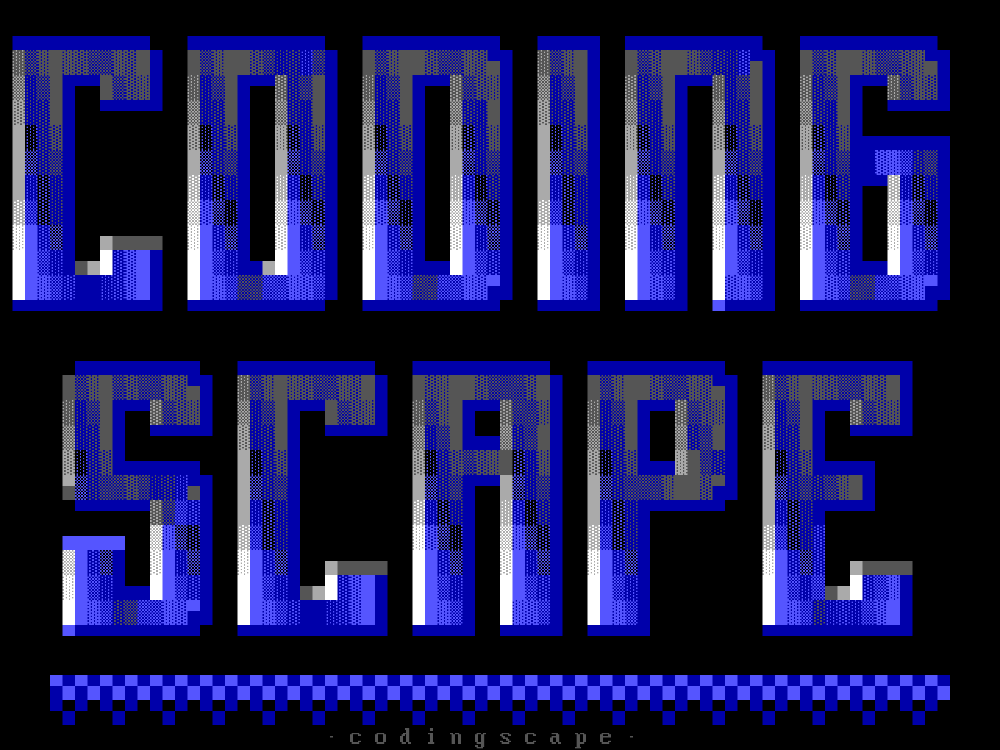
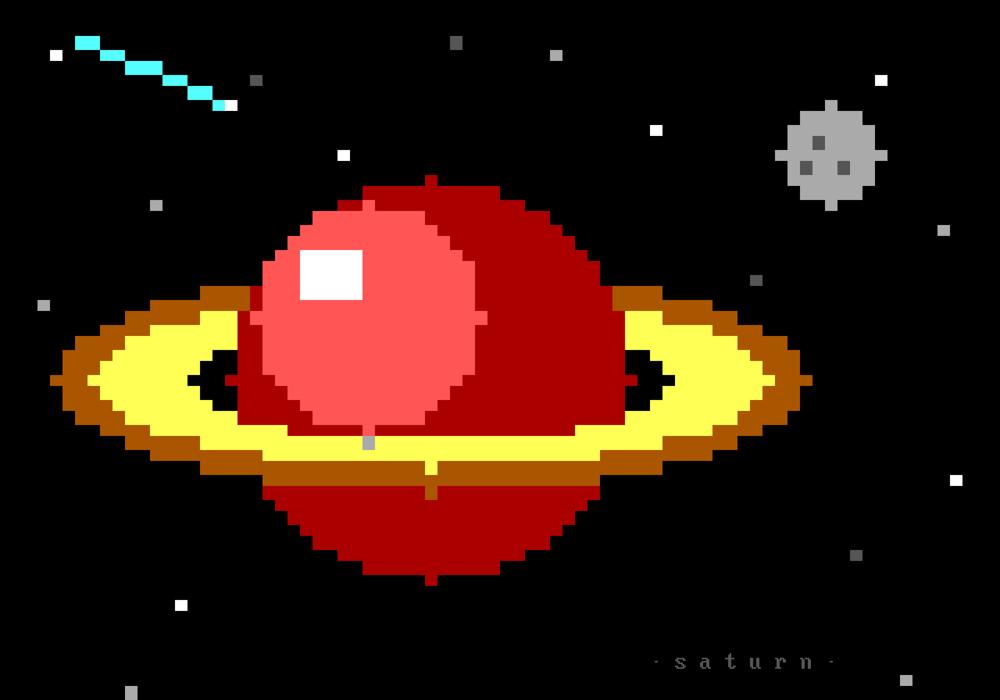

# ansidraw

A native terminal ANSI art editor in the spirit of **ACiDDraw** (ACiD Productions,
1994–1999). Runs anywhere a modern terminal does — macOS, Linux — no DOS emulator
required.



Reads and writes classic `.ANS` files: CP437 bytes with ANSI escape codes, the
format BBS art has always used. Full SAUCE support: records on loaded files are
read and preserved, and `Alt-D`/`Ctrl-D` opens a form to set title/author/group
and toggle attaching a record on save (dimensions and date are filled in
automatically, per the SAUCE.DOC spec). Verified against real ACiD artpack ANSIs — load → save →
load round-trips byte-identical canvases.

## Run

```
cargo run --release [file.ans]
```

Use a terminal at 80+ columns with a CP437-friendly font (any font with box-drawing
and block glyphs works — the canvas is Unicode on screen, CP437 on disk).

## Keys

Two keys cover everything if you don't want to memorize the rest:

- **`Ctrl-K` — command palette.** Type to filter every command (including picking
  any of the 15 character sets), Enter to run.
- **`Ctrl-E` — character picker.** Browse all 256 CP437 glyphs in a grid and
  insert one — the modern replacement for DOS `Alt`+numpad codes.

A **sidebar** on the right (when the terminal is ≥100 columns; `Ctrl-W` toggles)
shows the file, cursor position, color strips with your current fg/bg marked,
the active character set with its F-keys, and a cheatsheet — all clickable.

**Mouse:** click to move the cursor, drag to select a block (then use the block
keys, or click to re-anchor), click to stamp a carried block repeatedly, scroll
wheel to move through the canvas. The sidebar color strips set fg/bg, sidebar
glyphs draw, cheatsheet rows run their command, and all three popups (command
palette, character picker, quick palette) take clicks as well.

Classic keybindings follow the original where a modern terminal allows (Alt
combos need "Use Option as Meta" in Terminal.app/iTerm2; Ctrl fallbacks are
provided).

| | |
|---|---|
| **Draw** | type anything; `F1`–`F10` insert glyphs from the active set |
| Sets | `Alt-F1..F10` sets 1–10, `Ctrl-F1..F5` sets 11–15, `Ctrl-N`/`Ctrl-P` cycle |
| **Color** | `Esc` quick palette (↑↓ fg, ←→ bg) · `Ctrl-A` same |
| | `Ctrl-↑/↓` foreground, `Ctrl-←/→` background · `Alt-U` pick up color under cursor |
| **Blocks** | `Alt-B`/`Ctrl-B` select, then `C` copy · `M` move · `F` fill attr · `E` erase · `X`/`Y` flip |
| | copy/move enter stamp mode: `Enter` stamps at cursor (repeatable), `Esc` done |
| **Lines** | `Ctrl-T`/`Alt-I` insert line · `Ctrl-Y` delete line · `Ins`/`Del` shift line right/left |
| **Move** | arrows, `PgUp`/`PgDn`, `Home`/`End`, `Ctrl-Home`/`Ctrl-End` first/last char, `Tab` stops |
| **Files** | `Alt-S`/`Ctrl-S` save · `Alt-L`/`Ctrl-O` load · `Alt-C` clear page · `Alt-X`/`Ctrl-Q` exit |
| **SAUCE** | `Alt-D`/`Ctrl-D` edit title/author/group + attach toggle |
| **Undo** | `Alt-R`/`Ctrl-Z` undo (multi-level — better than the original!) · `Ctrl-R` redo |
| **Help** | `Alt-H`/`Ctrl-G` |
| **UI** | `Ctrl-K` command palette · `Ctrl-E` character picker · `Ctrl-W` sidebar |

## Layout

- `src/canvas.rs` — the 80×1000 cell grid (char + 16 fg / 8 bg colors)
- `src/ansi.rs` — `.ANS` load/save (SGR + cursor-movement parsing, SAUCE-aware EOF)
- `src/sauce.rs` — SAUCE v00 records (parse/write, COMNT blocks)
- `src/cp437.rs` — CP437 ↔ Unicode tables
- `src/charset.rs` — the 15 F-key character sets
- `src/main.rs` — the crossterm full-screen editor
- `src/bin/mcp.rs` — the MCP server (`ansidraw-mcp`)
- `src/render_png.rs` + `src/bin/ans2png.rs` — PNG rendering (VGA font/palette)
- `src/halfblock.rs` — pixel space: half-block encode/decode, lines, ellipses
- `src/import_image.rs` — PNG → half-block canvas conversion
- `examples/demo.rs` — generates a sample `.ans`; `examples/recode.rs` — round-trip checker

## PNG export

Three ways to get pixels out:

- **CLI**: `ans2png file.ans [out.png] [scale 1-8]` (default scale 4 → 2560px wide)
- **Editor**: `Ctrl-K` → "Export PNG image"
- **MCP**: the `render_png` tool returns the image inline (so the agent can see
  its colors) and optionally saves a file

Rendering uses the classic VGA 8×16 bitmap font and the authentic 16-color VGA
palette; the font bitmap comes from [libansilove](https://www.ansilove.org)
(BSD-2-Clause) — the engine behind 16colo.rs.

## Pixel space (half-block technique)

The canvas doubles as an 80x2000 grid of square pixels — two per text row,
packed into ▀/▄/█ glyphs (`src/halfblock.rs`). Plotting a pixel preserves the
other half of its cell, so image-style art can be built shape by shape. The MCP
server exposes it as `pixel_set`, `pixel_rect`, `pixel_line`, and
`pixel_ellipse` (filled or outline, with y-clipping for arcs and occlusion).

The one rule of the medium: ANSI backgrounds can only be dark colors 0-7, so
when two *different bright* colors stack in one cell the lower one is dimmed to
its nearest dark neighbor — align bright color boundaries to even pixel rows
(or separate regions with dark outlines, cartoon-style, which sidesteps it).

**Dithering**: `pixel_rect` takes an optional `color2` + `mix` for Bayer
ordered-dither fills — vary `mix` across bands to fake gradients the palette
can't reach. `import_image` takes `dither: true` to break smooth gradients
into mixed-color patterns instead of hard bands — for photos and gradients,
not flat cel art, where it just adds noise.

**Ink preservation**: `import_image` takes `ink: true` for line art — any
sample box where ≥25% of source pixels are near-black snaps to black, so
thin outline contours survive downscaling instead of averaging to gray.

**Cropping**: `import_image` takes `crop_x/crop_y/crop_w/crop_h` (source
pixels) so the 80-column budget can go to the subject, not empty backdrop.
PNG only — convert other formats first (`sips -s format png in.webp --out out.png`).

**256-color mode**: `import_image` takes `colors: 256` to quantize against the
full xterm-256 palette (16 VGA + 6x6x6 cube + 24 grays) — real skin tones, and
no dark-background constraint, so half-block pairs never degrade. Saving
auto-detects per cell: classic cells emit classic SGR, extended cells emit
`38;5`/`48;5`. Classic 16-color files stay byte-identical; 256-color files need
a modern terminal (old DOS-era viewers won't read them). Dither amplitude
auto-scales to the palette (strong for 16, gentle for 256 — usually unneeded).

## Scene lettering (TheDraw fonts)

`src/tdf.rs` parses .TDF files — the classic BBS-era format for big colored
letterforms. Eight fonts ship in `fonts/` (graffiti, cartoon, neon, fire,
block3dx, dream, metalix, iceblock; from the freely-shared scene archives via
the tdfiglet collection). The MCP `banner` tool stamps text in any of them
(glyphs keep their own colors and layer transparently over art); `list_fonts`
shows a file's fonts and measures text width. Most fonts are CAPS-only.

Saving takes `utf8: true` to write glyphs as UTF-8 instead of CP437 — same
escape codes, but modern terminals render it directly with `cat`. Classic
CP437 (the default) is what DOS-era viewers and 16colo.rs expect.

## MCP server

`ansidraw-mcp` lets an AI agent (e.g. Claude Code) draw on the canvas and save
real `.ANS` files. It speaks MCP over stdio and exposes `new_canvas`,
`put_text` (multi-line, layerable), `fill_rect`, `draw_box`
(single/double/block), `render` (text view), `render_png` (the agent sees the art with real colors), `save` (with SAUCE credits), and `load`. Register it with:

```
cargo build --release
claude mcp add ansidraw -- $(pwd)/target/release/ansidraw-mcp
```

## Roadmap

- [ ] iCE colors (16 backgrounds, `Alt-Z`) — needs `?33h`-style save option
- [ ] Block outline, text justify, load-into-block (the rest of the `Alt-B` menu)
- [ ] Multiple pages (`Alt-E`), 160-column canvases
- [ ] Configurable character sets + tab stops
- [ ] ASCII/binary/PCBoard export formats

## References

Original ACiDDraw 1.25 docs/binary: `ftp.artpacks.acid.org` (mirrored on
archive.org, item `aciddraw`). ANSI art archive: [16colo.rs](https://16colo.rs).


